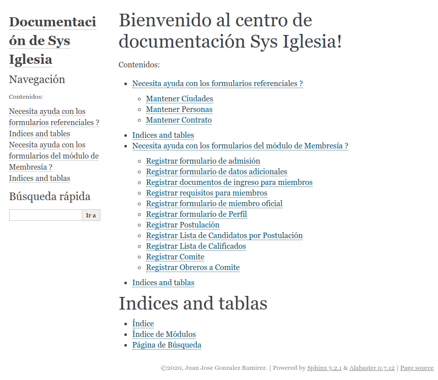

# Proyecto de documentación para el proyecto Sys Iglesia
* [Sys Iglesia](https://github.com/gallopelado/sys_iglesia) - Proyecto de tesis.

## Construído con 
* [Python](https://www.python.org/) - El lenguaje del backend.
* [Sphinx](https://www.sphinx-doc.org/en/master/index.html) - Herramienta de documentación.
* [Inkscape](https://inkscape.org/es/) - Software de vectores gráficos para el diseño de capturas.

## Versionado y repositorio
Se usa Git para el versionado y repositorio GitHub.

## Autor 
* **Juan Jose Gonzalez Ramirez**

### [UTIC](https://www.utic.edu.py/v7/)  - 2020